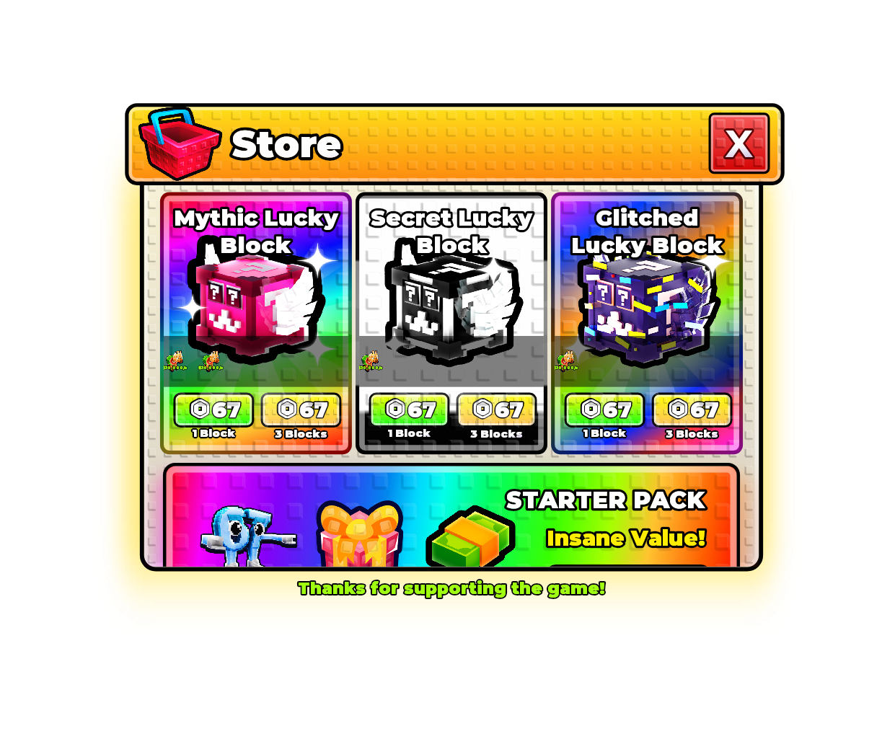
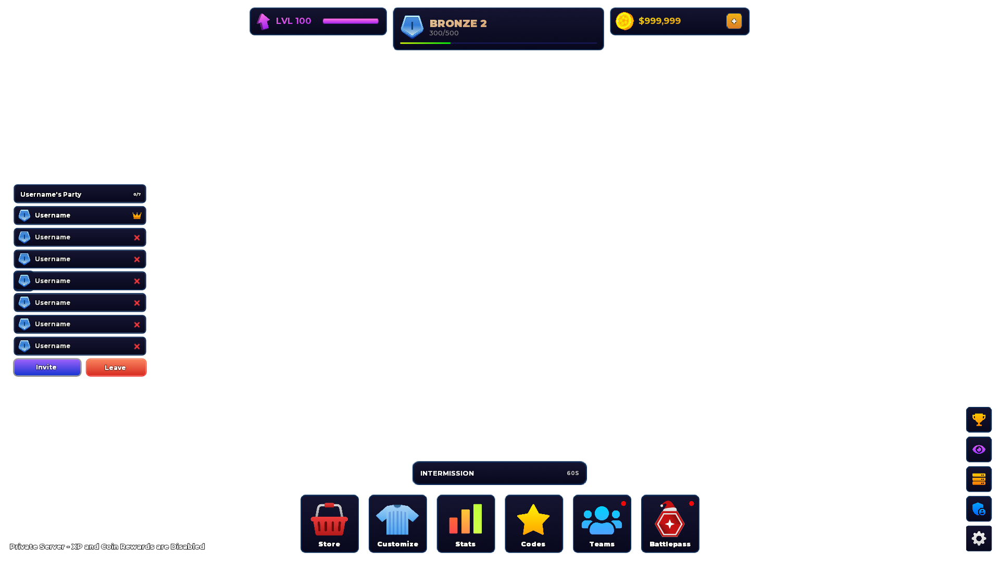
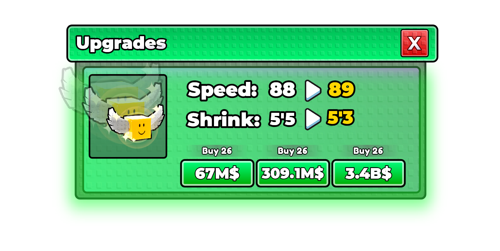

<div align="center">

# Pinevex Renderer

**A high-fidelity UI renderer for Roblox-style interface trees**

[](https://www.python.org/downloads/)
[](LICENSE)
<a href="https://pinevex-renderer-demo.vercel.app" target="_blank" rel="noopener noreferrer"></a>

<strong><a href="https://pinevex-renderer-demo.vercel.app" target="_blank" rel="noopener noreferrer">Test Pinevex Renderer with your own screengui RBXM in our web demo!</a></strong>



Rendered by Pinevex Renderer



Rendered by Pinevex Renderer



_yes, pinevex renderer can render THIS! ( and almost anything! )_

</div>

Pinevex Renderer is a CPU-only renderer that achieves near-parity with Roblox's internal UI engine for structured Roblox-style UI JSON.

Try it in the live web demo: <a href="https://pinevex-renderer-demo.vercel.app" target="_blank" rel="noopener noreferrer">pinevex-renderer-demo.vercel.app</a>.

The web demo accepts Pinevex JSON directly or a binary ScreenGui `.rbxm`, which it parses into Pinevex JSON before rendering.

The project originally existed to generate AI synthetic training data: structured Roblox-style UI trees could be rendered into reference images for model training, reconstruction, and validation loops.

It takes a nested UI tree and produces PNG previews that are close enough to be useful for reconstruction, validation, and export workflows. The renderer handles scale/offset layout, nested hierarchy, text fitting, strokes, gradients, rounded corners, tiled textures, icon references, and optional Luau generation.

This repository is intentionally scoped to the renderer layer.

## Why this exists

Screenshot-to-editable-UI systems need more than image similarity. A generated result has to become structured, editable UI, then render back into something close to the original screenshot.

## Roblox UI coverage

The renderer uses Roblox-native UI concepts and exports matching Luau instances where possible. It is not a complete reimplementation of every Studio property, but it covers the common surface used by game UI screenshots.

Supported `GuiObject` classes:

- `Frame`
- `CanvasGroup`
- `ScrollingFrame`
- `TextLabel`
- `TextButton`
- `TextBox`
- `ImageLabel`
- `ImageButton`

Accepted for layout/export compatibility:

- `ScreenGui`
- `ViewportFrame`
- `VideoFrame`

Supported core `GuiObject` properties:

- `Size` and `Position` as `UDim2` scale/offset values
- `AnchorPoint`
- `BackgroundColor3`
- `BackgroundTransparency`
- `BorderSizePixel`
- `ZIndex`
- `LayoutOrder`
- `Visible`
- `ClipsDescendants`
- `Rotation`
- `AutomaticSize`
- `SizeConstraint`

Supported Roblox UI instances and constraints:

- [`UICorner`](https://create.roblox.com/docs/reference/engine/classes/UICorner): `CornerRadius`
- [`UIStroke`](https://create.roblox.com/docs/reference/engine/classes/UIStroke): `Color`, `Transparency`, `Thickness`, `ApplyStrokeMode`, `BorderStrokePosition`, `LineJoinMode`, `StrokeSizingMode`, plus gradient strokes
- [`UIGradient`](https://create.roblox.com/docs/reference/engine/classes/UIGradient): `Color`, `Transparency`, `Rotation`, `Offset`
- [`UIPadding`](https://create.roblox.com/docs/reference/engine/classes/UIPadding): `PaddingTop`, `PaddingBottom`, `PaddingLeft`, `PaddingRight`
- [`UIListLayout`](https://create.roblox.com/docs/reference/engine/classes/UIListLayout): `FillDirection`, `HorizontalAlignment`, `VerticalAlignment`, `Padding`, `Wraps`, `SortOrder = LayoutOrder`
- [`UIGridLayout`](https://create.roblox.com/docs/reference/engine/classes/UIGridLayout): `CellSize`, `CellPadding`, `FillDirection`, `HorizontalAlignment`, `VerticalAlignment`, `SortOrder = LayoutOrder`
- [`UIAspectRatioConstraint`](https://create.roblox.com/docs/reference/engine/classes/UIAspectRatioConstraint): `AspectRatio`
- [`UITextSizeConstraint`](https://create.roblox.com/docs/reference/engine/classes/UITextSizeConstraint): `MinTextSize`, `MaxTextSize`
- [`UIScale`](https://create.roblox.com/docs/reference/engine/classes/UIScale): `Scale`

Supported text properties:

- `Text`
- `TextColor3`
- `TextSize`
- `TextScaled`
- `TextWrapped`
- `TextTransparency`
- `TextXAlignment`
- `TextYAlignment`
- `RichText`
- `LineHeight`
- `FontFace` families, weights, and styles

Supported image properties:

- `Image`
- `ImageColor3`
- `ImageTransparency`
- `ScaleType`: `Stretch`, `Fit`, `Crop`, `Tile`, `Slice`
- `TileSize`
- `SliceCenter`
- `SliceScale`
- `ImageRectSize`
- `ImageRectOffset`

Supported `ScrollingFrame` behavior:

- `CanvasSize`
- `AutomaticCanvasSize`
- `ScrollingDirection`
- `ScrollBarImageColor3`
- `ScrollBarImageTransparency`
- `ScrollBarThickness`
- normalized preview-time `canvasPosition` for rendering scrolled content

## Quick start

Use the hosted demo here: <a href="https://pinevex-renderer-demo.vercel.app" target="_blank" rel="noopener noreferrer">https://pinevex-renderer-demo.vercel.app</a>.

Create a Python environment and install dependencies:

```bash
python -m venv .venv
source .venv/bin/activate
pip install -r requirements.txt
```

Start the API:

```bash
uvicorn api.index:app --reload
```

Render the included example to a PNG:

```bash
curl -s http://127.0.0.1:8000/preview.png \
  -H 'Content-Type: application/json' \
  --data '{"pinevex_object": '"$(cat examples/simple-ui.json)"', "viewport_size": [420, 180], "transparent_background": true}' \
  --output preview.png
```

## API

### `GET /health`

Returns a small status payload confirming the vendored runtime pieces are present.

### `GET /font-health`

Returns bundled font diagnostics. If `RENDERER_API_KEY` is set, this endpoint requires authorization.

### `POST /preview.png`

Returns a rendered PNG directly.

```json
{
  "pinevex_object": {
    "type": "Frame",
    "size": [1, 0, 1, 0],
    "bg": [24, 28, 36],
    "children": []
  },
  "viewport_size": [420, 180],
  "transparent_background": true
}
```

### `POST /render`

Returns a JSON response with the normalized object, optional base64 PNG preview, and optional Luau output.

```json
{
  "pinevex_object": {"type": "Frame", "children": []},
  "allow_partial": true,
  "include_preview": true,
  "include_luau": true,
  "viewport_size": [1204, 168],
  "transparent_background": true
}
```

`pinevex_object` may be a JSON object or a string containing partial JSON. `viewport_size` accepts `[width, height]`, `{"width": 1204, "height": 168}`, `"1204x168"`, or `"1204,168"`. When omitted, the renderer uses `1920x1080`. Set `transparent_background` to `true` to return a PNG with a transparent canvas instead of a white canvas.

## JSON shape

The renderer expects a nested UI tree with Roblox-like fields:

```json
{
  "type": "TextButton",
  "name": "PrimaryButton",
  "size": [0.58, 0, 0.28, 0],
  "position": [0.5, 0, 0.68, 0],
  "anchor": [0.5, 0.5],
  "bg": [64, 179, 108],
  "corner": 0.12,
  "text": "Open",
  "textColor": [255, 255, 255],
  "textScaled": true,
  "font": "Montserrat",
  "fontWeight": "Bold",
  "children": []
}
```

See [`examples/simple-ui.json`](examples/simple-ui.json) for a complete minimal example.

## Configuration

- `RENDERER_API_KEY`: optional bearer token required by render endpoints when set.
- `ICON_CACHE_DIR`: optional cache directory for fetched Roblox asset thumbnails. Defaults to `/tmp/pinevex-renderer/cache/icons`.
- `PINEVEX_RENDERER_ICON_OVERRIDES`: optional path to a local JSON map of Roblox asset IDs to bundled icon keys. This is useful for private renderer parity fixes and should not be committed.
- `PINEVEX_RENDERER_ROBLOX_FONT_DIRS`: optional `PATH`-separated list of local Roblox font directories used as extra fallbacks.

## Repository scope

This repository contains the renderer/API runtime and small examples. The bundled icon manifest is a minimal texture-key subset, not the private asset catalog, and does not include concrete private asset IDs.

## License

Pinevex-authored source code is licensed under the [Apache License 2.0](LICENSE).

Bundled third-party fonts and native runtime libraries retain their original licenses. See [THIRD_PARTY_NOTICES.md](THIRD_PARTY_NOTICES.md).

## Project structure

```text
api/
  index.py                      FastAPI entrypoint
examples/
  simple-ui.json                Minimal renderable UI tree
vendor/
  icon_library/manifest.json    Minimal public texture-key manifest
  native/                       Linux runtime libraries for hosted rendering
  product_output/               Pinevex postprocess and Luau export helpers
  ui_engine/                    Layout, text, image, and Skia rendering code
requirements.txt
vercel.json
```

## Status

This is a technical artifact extracted from a larger screenshot-to-editable-UI reconstruction project. It is useful as a renderer/API reference, but it is not packaged as a polished product SDK.

<hr>

Note: README.md written by GPT 5.5, roughly human-reviewed.
